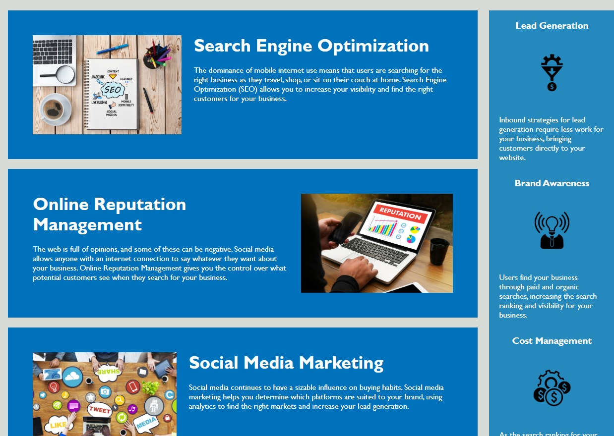

# 1_Code_Refactor
**Homework assignment #1**

The client requested a codebase that follows accessibility standards to optimize for search engines.  

During review I cleaned up: 

- Redundant CSS Classes and Code
- Fixed Broken Links in the Nav
- Modified HTML code to include semantics
- Added ALT and Title attributes to Images.

[Link to Website](https://cjlaflamme1.github.io/1_Code_Refactor/)

---

---

